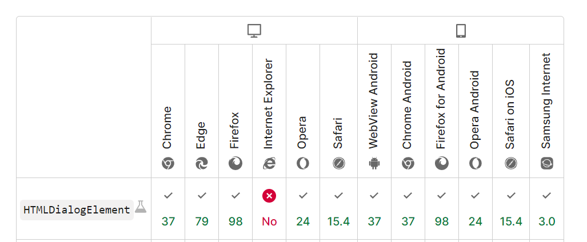

# `Dialog` in HTML and JS?

## Explaination


In this tutorial, we will create a dialog box or window using the `Dialog`. This tag is used to create popup dialog and models on a web page. This tag is new in HTML5.

#### The difference between a popup `div` and a `dialog`

The basic difference between a `dialog` window and a popup is that a `dialog` window usually requires some form of feedback, such as a button interaction. A popup window can include anything, such as a picture gallery, video, or a copy, for example.

<br>

## How to use it
##### HTML
In HTML you simply use `dialog` like a `div`. Typing it like this; `<dialog>`, `</dialog>`. Don't forget to add an open button and close button for the `dialog` to open and close!
```html
    <button id='open'>open</button>

    <dialog>
        <h1>This is a dialog!</h1>
        <button id='close'>close</button>
        <p>Put some content here</p>
    </dialog>
```

##### JavaScript
In JS we should be making the buttons to work, so that the `dialog` element opens and closes. Just like the below.
```js
open.addEventListener('click', function () {
    /*
        There are dufferent ways to open the dialog.
        Here are the recommended to use:
            .show()
            .showModal()
    */
    dialogModal.showModal();
});
close.addEventListener('click', function () {
    dialogModal.close();
});
```

<br>

## Browser compatability
The `dialog` element is supported by most browsers. Here's a visual example I found from MDN web docs.



<br>

## Example
- [HTML](index.html)
- [JS](assests/js/index.js)

<br>

## References 
- [MDN web docs dialog](https://developer.mozilla.org/en-US/docs/Web/HTML/Element/dialog)
- [MDN web docs dialog.close()](https://developer.mozilla.org/en-US/docs/Web/API/HTMLDialogElement/close)
- [MDN web docs dialog.show()](https://developer.mozilla.org/en-US/docs/Web/API/HTMLDialogElement/show)
- [Peachpit](https://www.peachpit.com/articles/article.aspx?p=1943945&seqNum=2#:~:text=The%20main%20difference%20between%20a,%2C%20copy%2C%20and%20so%20on.)
- [MDN web docs dialog.showModal()](https://developer.mozilla.org/en-US/docs/Web/API/HTMLDialogElement/showModal)
- [Geeksforgeeks How to create a dialog box or window in HTML ](https://www.geeksforgeeks.org/how-to-create-a-dialog-box-or-window-in-html/)